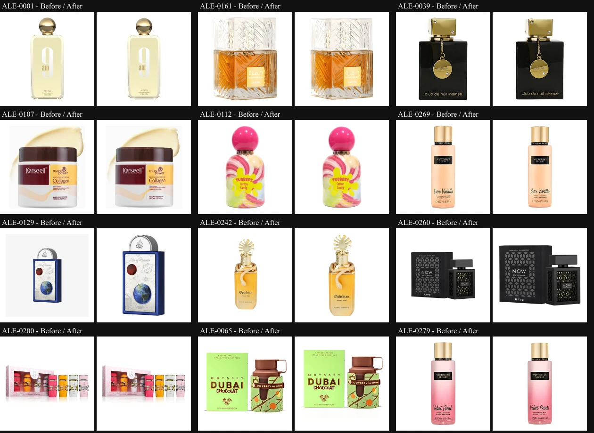

# Product image pipeline and verification

Implementation and local verification: 2026-09-21. Source acquisition remains a separate editorial queue; this release does not claim to restore detail missing from supplied photographs.

## Delivered

- Inventoried all 279 selected historical sources, verified SHA-256 against the previous normalization manifest and preserved the five verified replacements. The archived sources and documentary derivatives were read only.
- Generated 160, 320, 480 and 800 px AVIF/WebP pairs directly from selected sources, with 1200 px pairs for 31 crops that contain at least 1056 px on their longest side. Total: 2,294 images, including the 558 canonical `ALE-####.avif/.webp` files.
- Standardized a white square canvas, proportional containment, optical centering and an 88% subject area. Cropping uses a near-white foreground bound with a safety margin; it does not crop a product to fill the square. Transparent margins in ALE-0242 and ALE-0260 no longer make the products disproportionately small.
- Cleaned only the reviewed connected grey surround of ALE-0129. Enclosed label details remain unchanged. Other photographic backgrounds and artwork are recorded in the quality queue; no global color filter, generative restoration or sharpening is used.
- Added route-specific `srcset`/`sizes`, lazy loading and reserved dimensions. Hero/detail and the measured first catalog LCP image get priority. The zoom image is mounted only after opening the dialog; Escape/close restore focus.
- Added checksum, decoding, dimension, format, ID coverage and stale-file validation to CI, plus tests for source framing, background isolation, deterministic encoding and corrupted/incomplete assets.

The additional `sharp` dependency is development-only and pinned. It provides deterministic image decoding/resizing/encoding and validation; it is not included in the browser bundle or a runtime service. Encoder versions and settings are recorded in the output manifest. Reproducibility is scoped to the pinned toolchain.

## Source and review artifacts

- [Source inventory](images/sources.json): relative source filename, format, actual dimensions, color space/profile, transparency, checksum, crop, reviewed exceptions and prior output hashes for every ID.
- [Output manifest](images/outputs.json): every output path, size, dimensions and checksum, with the encoder recipe/version.
- [Source quality queue](images/quality-queue.md): prioritized replacement criteria and all 206 crops below 704 px of usable detail. Twelve retained photographic backgrounds and six embedded-artwork cases are also identified.
- [Pilot comparison](images/pilot-review.webp): original on the left, delivered framing on the right, for all 12 pilot products.



The source collection was recovered from `90 Archivo/Imagenes de productos/2026-09-19 originales referenciales` in the project library. Its selected sources match the previous manifest, including replacements for ALE-0056, ALE-0058, ALE-0092, ALE-0172 and ALE-0235. Eight additional 800 px advertising PNGs were excluded because they do not provide clean, higher-resolution product photographs. Original supplier URLs, usage permissions and capture/upscaling history are not established by the supplied manifests.

The 12-product pilot was generated and visually compared at 88, 320 and 588 px before accepting the full rollout. All 279 delivered products were then reviewed across six contact sheets. The full run encoded in six batches (50/50/50/50/50/29) and promoted output after successful generation. Staging and browser verification were local; production receives one reviewed release rather than six intermediate public catalog states.

## Measured image transfer

Built-site Chromium checks used the same first 24 catalog products, 900 px viewport height, viewport widths below and device pixel ratios (DPR) 1/2. Browser cache was disabled/cleared; all 24 images were requested deliberately to compare a complete page batch rather than a variable lazy-loading threshold. Values are encoded image response bodies, not total page bytes or field performance data.

| Viewport | DPR | Before, bytes | After, bytes | Reduction |
| --- | --- | --- | --- | --- |
| 320 | 1 | 310,461 | 37,276 | 88.0% |
| 320 | 2 | 310,461 | 87,945 | 71.7% |
| 390 | 1 | 310,461 | 87,945 | 71.7% |
| 390 | 2 | 310,461 | 149,842 | 51.7% |
| 768 | 1 | 310,461 | 149,842 | 51.7% |
| 768 | 2 | 310,461 | 277,887 | 10.5% |
| 1440 | 1 | 310,461 | 87,945 | 71.7% |
| 1440 | 2 | 310,461 | 277,887 | 10.5% |

The 30% target is met where the selected variants are below 800 px. Larger DPR 2 cards still need the 800 px source, so that case is not forced to meet the target through additional quality loss.

In fresh sessions, selection thumbnails use 160 px at 72 CSS px/DPR 2 and 320 px at 88 CSS px/DPR 2. A browser may reuse an already-decoded larger image after visiting a hero/detail; that is not a new 800 px thumbnail download. High-resolution detail/zoom selects 1200 px where supported; limited sources stop at 800 px.

Controlled catalog LCP ranged from 100-140 ms before and 76-180 ms after on this local machine. These single-run samples are noisy and are not evidence of an improved production Core Web Vitals score. No image-attributed layout shift was observed. One after-run recorded total CLS 0.000406 from text/font movement; the other seven recorded zero. The first product image was the observed catalog LCP element, which motivated its priority hint.

Browser QA also covered home, selection and low/high-resolution details across the eight viewport/DPR combinations: 32 route checks, successful WebP fallback, deferred zoom loading, focus restoration, no horizontal overflow and no runtime/HTTP errors. The full 2,294-file validator decodes every AVIF and WebP, including variants not selected by that browser.

## Generate and validate

From the repository root, with the archived source directory located through local project context:

```powershell
npm ci
npm run generate:images -- --source-dir '<verified-source-directory>' --pilot
# Or generate explicit reviewed IDs:
npm run generate:images -- --source-dir '<verified-source-directory>' --ids ALE-0129,ALE-0242,ALE-0260
# Omit --pilot/--ids to generate the whole inventory.
npm run validate:catalog
npm run validate:images
npm run test:images
npm run test:catalog
npm run build
npm run test:sites
npm run test:metadata
```

The generator verifies every requested source checksum before writing assets, stages all encodes outside the repository, processes at most 50 products per batch with three workers, and updates the output/availability manifests. It does not fetch replacement pictures, alter the source library or add product attributes. A source hash or reviewed-crop mismatch stops generation. A normal build/CI does not require access to the documentary library: committed assets and manifests are validated directly.

For a new or replacement source, first update its reviewed inventory record and provenance, verify the exact catalog identity and crop, then regenerate the affected ID and inspect all sizes. If available widths shrink or an ID is removed, remove only its now-obsolete responsive files as part of that reviewed change; the validator deliberately rejects leftover files.

## Release and rollback

Baseline before this work: `a103bca1fd6c510dc07b415da5192f41215b0b10`. Its canonical assets remain available in Git history and their hashes are in the source inventory. Publish the reviewed commits through the existing GitHub/Vercel integration, check CI/CodeQL and request production routes and representative variants. To roll back, revert the coherent image pipeline/delivery commits together (assets, manifests and consuming UI), validate, and publish the revert through the same integration. Do not mix an old manifest with new files or delete source photographs.

References: [responsive image selection](https://web.dev/learn/images/responsive-images), [Sharp resizing](https://sharp.pixelplumbing.com/api-resize/) and [Sharp output formats](https://sharp.pixelplumbing.com/api-output/).
